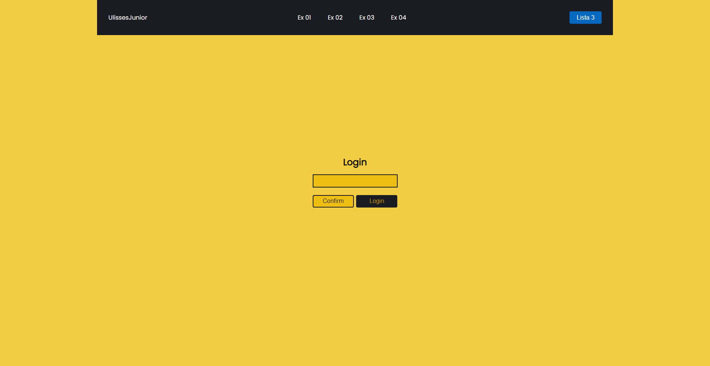
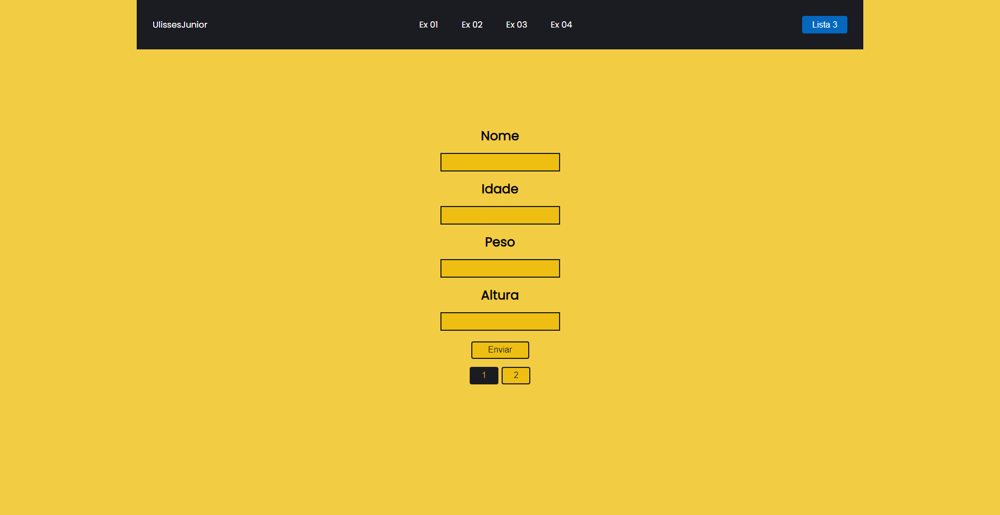
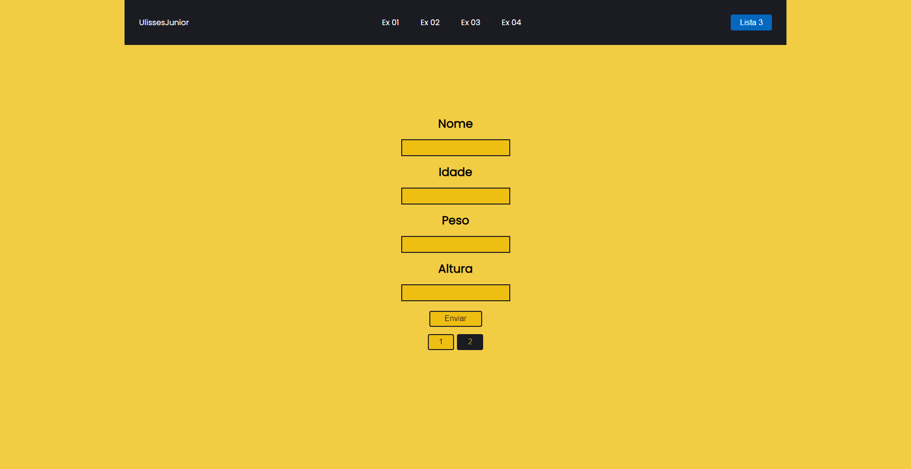
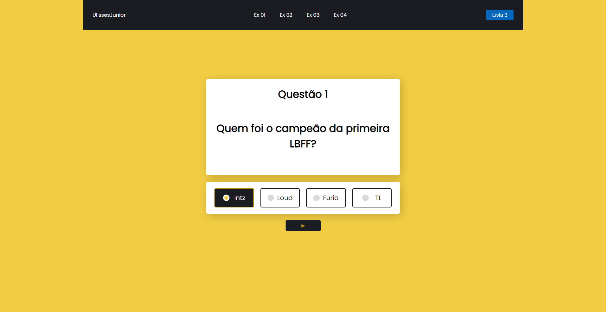

# Form_PHP-3
Meu segundo bimestre trabalhando com PHP, esse arquivo é a terceira lista do bimestre sobre o assunto (2ºBimestre/2021)

  
## Exercício 1
No PHP: O programa recebe o nome do usuário, o mesmo deve apertar "confirmar" para validar os dados, depois ele aperta "login" e é redirecionado para uma página de iniciação onde contém a mensagem "Bem vindo 'Nome do Usuário'"

  
## Exercício 2
No PHP: O programa recebe o nome e senha do usuário, o mesmo deve apertar "login" para validar os dados. Os dados são enviados para o arquivo de checagem, se o usuário for "automacao" e a senha ser "turma1au" ele é redirecionado para uma página de iniciação onde contém a mensagem "Seja bem vindo ao sistema integrado", caso contrário o usuário não conseguirá fazer login.

  
## Exercício 3
No PHP: O programa recebe o nome, idade, peso e altura do usuário e o direciona para uma 2º página com as mesmas perguntas. Depois de responder as 2 páginas, o usuário é direcionado para uma página de resultado onde compara os resultados com as seguintes requisições "quem tem a altura maior", "quem é mais velho" e "quem tem o peso maior".

  
## Exercício 4
No PHP: O programa recebe o nome do usuário e o direciona para uma página de quiz com 10 questões, após responder as 10 perguntas, o usuário recebe a mensagem "Parabéns 'Nome do usuário'! Quiz concluído", depois uma mensagem demonstrando o número de erros e acertos do participante.

